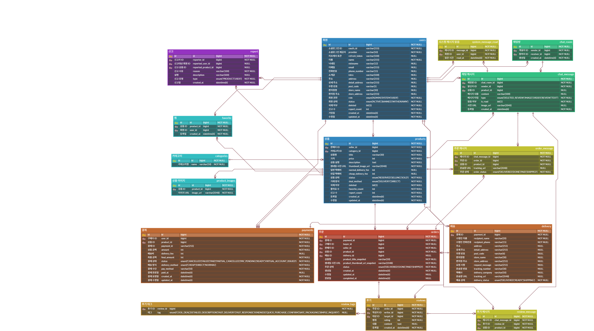

# 📦 SecondHand: 중고거래 웹 서비스

## 프로젝트 소개
이커머스 서비스의 전체적인 흐름을 경험하고, 데이터 관리 능력을 기르기 위해 번개장터와 같은 택배 기반의 중고거래 사이트를 기획하고 개발했습니다.

- **개발 기간:** 2025.05 ~ 2025.07 (3개월)
- **개발 인원:** 1인 (개인 프로젝트)

## 주요 기능

1. 주문 및 결제
    - PortOne API 연동 결제
    - 판매자/구매자별 주문서 분리
    - 거래 완료 후 후기 작성

2. 상품 관리
    - 상품 CRUD
    - 상품 찜/신고
    - 전체, 카테고리별 최신순/좋아요순 정렬

3. 채팅
    - WebSocket, STOMP 기반 1:1 채팅
    - 주문/후기 상태별 시스템 메시지 전송

4. 회원 관리
    - OAuth2 소셜 로그인
    - JWT 인증
    - 회원 정보 수정/탈퇴
    - User Role 기반 권한 분리

## 기술 스택
- **Backend:** Java, Spring Boot
- **Database:** MySQL
- **DevOps & Infra:** AWS ec2

## 시스템 아키텍처

